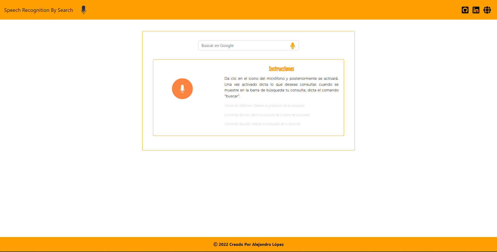

# <h1 align="center" style="color: #80cbc4;"> Speech Recognition API 👨🏻‍💻 </h1> 
  

Learn how to add `Speech Recognition` to your websites and web applications with JavaScript, using the Web Speech API. Speech recognition involves receiving speech through a device's microphone, which is then checked by a speech recognition service and a result is returned as a text string.   

`Web Speech API` allows for Speech Recognition in the browser, using JavaScript. This opens up many new possibilities regarding user interaction with websites and web applications.     
  

## 
 Requirements 

- [HTML5](https://developer.mozilla.org/es/docs/Web/HTML) 
- [CSS3](https://developer.mozilla.org/es/docs/Web/CSS)
- [JavaScript](https://developer.mozilla.org/es/docs/Web/JavaScript)

## 
 References 

- [Web Speech API](https://developer.mozilla.org/en-US/docs/Web/API/Web_Speech_API)
- [Speech Recognition](https://developer.mozilla.org/en-US/docs/Web/API/SpeechRecognition) 

  

## 
 Screenshot Project 💻 

🔶 [Project Website](https://alejandro-190107.github.io/Speech-Recognition-API/)

